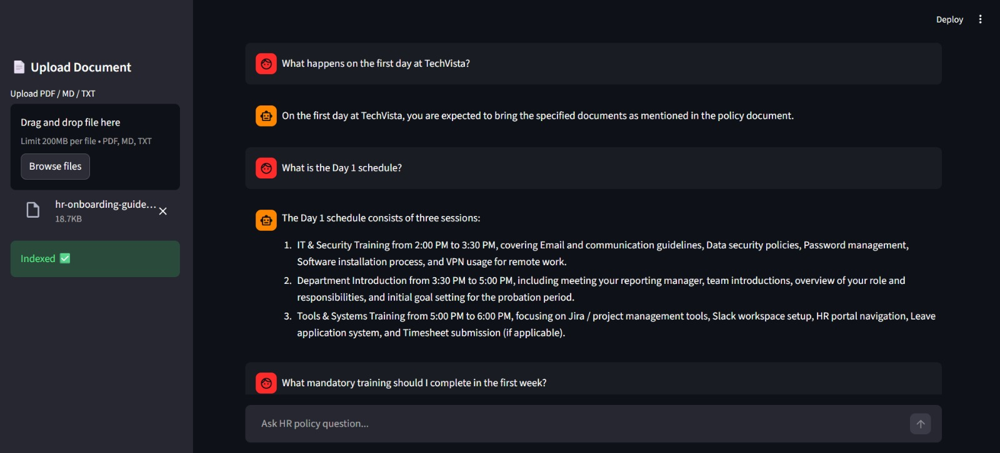

# 🧠 HR RAG — HR Policy Retrieval & Question Answering System

[](https://www.python.org/downloads/)
[](https://fastapi.tiangolo.com/)
[](https://opensource.org/licenses/MIT)

A production-ready **Retrieval-Augmented Generation (RAG)** system for HR knowledge management that enables semantic search and context-grounded question answering over HR policy documents (PDF, TXT, Markdown).

Built with **FastAPI + Qdrant + MongoDB + LangChain + Local LLMs (Ollama)**.




---

## 🎯 Overview

HR RAG allows organizations to:
- **Upload** HR documents (policies, handbooks, employee guides)
- **Index** them into a vector database with semantic embeddings
- **Query** using natural language questions
- **Get** context-grounded answers with source attribution

**Key Differentiator:** Dual-database architecture combining vector search (Qdrant) with metadata traceability (MongoDB) for production-grade retrieval quality and observability.

---

## ✨ Features

### Core Capabilities
- 📄 **Multi-format Document Ingestion** — PDF, TXT, Markdown support
- ✂️ **Semantic Chunking** — Recursive text splitting with configurable overlap
- 🧬 **Vector Embeddings** — Sentence-Transformers (all-MiniLM-L6-v2, 384-dimensional)
- 🗄 **Dual Database Architecture** — Qdrant (vector search) + MongoDB (metadata/traceability)
- 🔎 **Semantic Search API** — Top-K retrieval with similarity scoring
- 💬 **RAG-based Q&A** — Context-grounded answers using local LLM (Ollama/Mistral)
- 📤 **Document Upload API** — Automated parsing, chunking, and indexing
- 📊 **Retrieval Evaluation** — Keyword-hit metrics and quality scoring
- 🧪 **Guardrails & Confidence** — Answer confidence scoring and grounding checks
- 🐳 **Docker-Ready** — Containerized vector DB and MongoDB setup

### Advanced Features
- **Query Expansion** — Multi-query generation for improved recall
- **Reranking Layer** — Post-retrieval relevance optimization
- **Source Attribution** — Document ID and chunk references for every answer
- **Modular Pipeline** — Pluggable components for embeddings, retrieval, and LLMs

---

## 🏗 System Architecture

```
┌─────────────┐
│ User Query  │
└──────┬──────┘
       │
       ▼
┌─────────────────────┐
│  FastAPI Backend    │
└──────┬──────────────┘
       │
       ▼
┌─────────────────────┐
│ Embedding Model     │
│ (MiniLM-L6-v2)      │
└──────┬──────────────┘
       │
       ▼
┌─────────────────────┐
│ Qdrant Vector       │
│ Similarity Search   │
└──────┬──────────────┘
       │
       ▼
┌─────────────────────┐
│ Top-K Context       │
│ Retrieval           │
└──────┬──────────────┘
       │
       ▼
┌─────────────────────┐
│ Local LLM           │
│ (Ollama/Mistral)    │
└──────┬──────────────┘
       │
       ▼
┌─────────────────────┐
│ Grounded Answer     │
│ + Source References │
└─────────────────────┘
```

**Dual Database Design:**
- **Qdrant** → Vector similarity search for semantic retrieval
- **MongoDB** → Document metadata, chunk references, and traceability

---

## 📂 Project Structure

```text
HR_RAG/
├── app/
│   ├── api/
│   │   ├── __init__.py
│   │   └── main.py              # FastAPI endpoints (search, QA, upload, eval)
│   ├── db/
│   │   ├── __init__.py
│   │   └── mongo.py             # MongoDB metadata layer
│   ├── ingest/
│   │   ├── __init__.py
│   │   └── ingest_hr_docs.py   # Document ingestion pipeline
│   └── pipeline.py              # File processing pipeline
├── rag/
│   ├── __init__.py
│   ├── rag_engine.py            # Core RAG logic
│   ├── reranker.py              # Post-retrieval reranking
│   ├── evaluator.py             # Retrieval evaluation metrics
│   ├── query_expander.py        # Multi-query expansion
│   └── confidence.py            # Answer confidence scoring
├── data/
│   ├── hr_docs/                 # Base HR documents
│   └── uploads/                 # API-uploaded documents
├── ui/
├── requirements.txt             # Python dependencies
└── README.md                    # This file
```

---

## ⚙️ Tech Stack

| Component | Technology |
|-----------|-----------|
| **Backend** | FastAPI, LangChain, Pydantic |
| **Vector Database** | Qdrant |
| **Metadata Store** | MongoDB |
| **Embeddings** | Sentence-Transformers (all-MiniLM-L6-v2) |
| **LLM** | Ollama (Mistral, Llama2, etc.) |
| **Document Processing** | PyPDF2, python-docx, Markdown |
| **Chunking** | LangChain RecursiveCharacterTextSplitter |
| **Language** | Python 3.10+ |

---


## 👤 Author

**Achuth Abhay**
- GitHub: [@achuthabhay](https://github.com/achuthabhay)
- LinkedIn: [achuthabhay](https://www.linkedin.com/in/achuth-abhay-0757762b0/)


## 🙏 Acknowledgments

- [FastAPI](https://fastapi.tiangolo.com/) for the incredible web framework
- [LangChain](https://langchain.com/) for RAG abstractions
- [Qdrant](https://qdrant.tech/) for high-performance vector search
- [Sentence-Transformers](https://www.sbert.net/) for embedding models
- [Ollama](https://ollama.ai/) for local LLM inference

