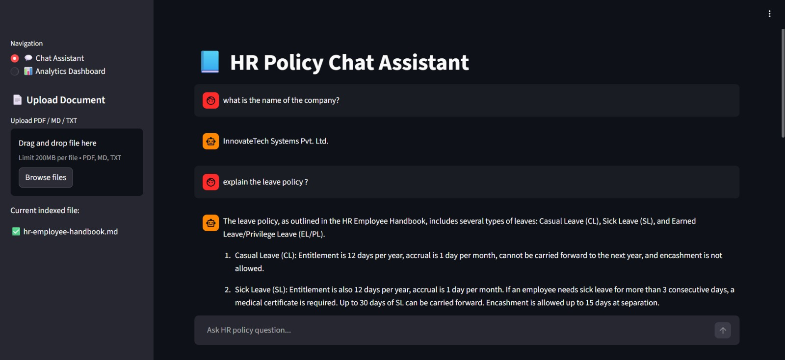
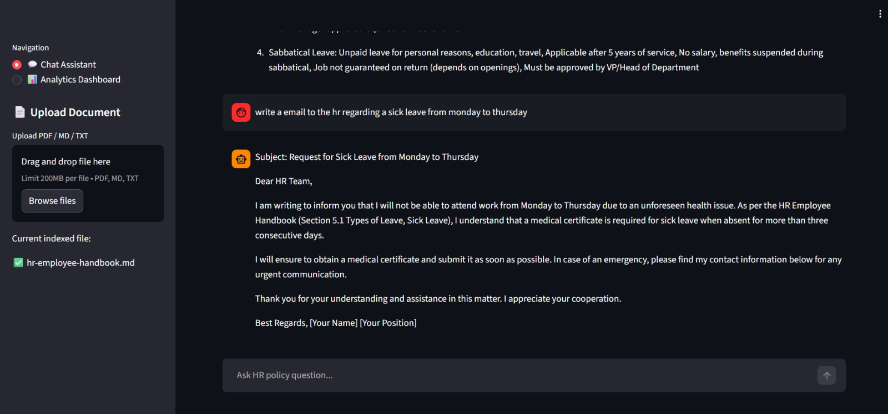
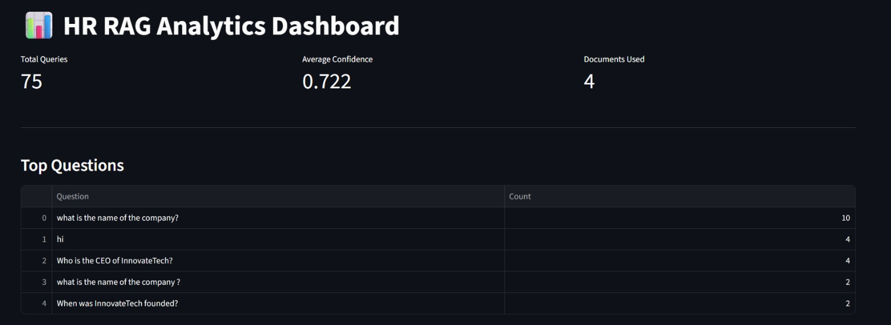

# 🧠 HR RAG — HR Policy Retrieval & Question Answering System

[](https://www.python.org/downloads/)
[](https://fastapi.tiangolo.com/)
[](https://opensource.org/licenses/MIT)

RAG-based HR automation system with semantic retrieval, grounded Q&A, AI email generation, confidence scoring, and analytics dashboard.

Built with **FastAPI + Qdrant + MongoDB + LangChain +  LLM (Groq)**.









---

## 🎯 Overview

HR RAG allows organizations to:
- **Upload** HR documents (policies, handbooks, employee guides)
- **Index** them into a vector database with semantic embeddings
- **Query** using natural language questions
- **Get** context-grounded answers with source attribution

**Key Differentiator:** Dual-database architecture combining vector search (Qdrant) with metadata traceability (MongoDB) for production-grade retrieval quality and observability.

---

## ✨ Features

### Core Capabilities
- 📄 **Multi-format Document Ingestion** — PDF, TXT, Markdown support
- ✂️ **Semantic Chunking** — Recursive text splitting with configurable overlap
- 🧬 **Vector Embeddings** — Sentence-Transformers (all-MiniLM-L6-v2, 384-dimensional)
- 🗄 **Dual Database Architecture** — Qdrant (vector search) + MongoDB (metadata/traceability)
- 🔎 **Semantic Search API** — Top-K retrieval with similarity scoring
- 💬 **RAG-based Q&A** — Context-grounded answers using local LLM (Groq)
- 📤 **Document Upload API** — Automated parsing, chunking, and indexing
- 📊 **Retrieval Evaluation** — Keyword-hit metrics and quality scoring
- 🧪 **Guardrails & Confidence** — Answer confidence scoring and grounding checks
- 🐳 **Docker-Ready** — Containerized vector DB and MongoDB setup
- ✉️ **AI Email Generator** — Automatically generates HR emails (leave requests, resignation, approvals) grounded in company policies

### Advanced Features
- **Confidence Scoring Layer** — Combines similarity score, keyword coverage, and retrieval completeness
- **Source Attribution** — Document references for every answer
- **MongoDB Query Logging** — Stores user queries, retrieved sources, and confidence scores
- **Analytics Dashboard** — Streamlit-based dashboard for monitoring usage and performance
- **Strict Grounding Guardrails** — Prevents hallucination by enforcing context-only answering
- **Modular Architecture** — Pluggable embeddings, vector DB, and LLM components


---

## 🏗 System Architecture

```
User Query
│
▼
FastAPI Backend
│
▼
Embedding Model (MiniLM-L6-v2)
│
▼
Qdrant Vector Search
│
▼
Top-K Context Retrieval
│
▼
Confidence Scoring Layer
│
▼
LLM (Groq)
│
▼
Grounded Answer +E-mail genration+ Sources + Confidence Score
│
▼
MongoDB Logging
```

This architecture enables scalable HR automation including semantic search, grounded question answering, AI email generation, and analytics monitoring using a dual-database design.

**Dual Database Design:**
- **Qdrant** → Vector similarity search for semantic retrieval
- **MongoDB** → Document metadata, chunk references, and traceability

---

## 📂 Project Structure

```text
HR_RAG/
├── app/
│   ├── api/
│   │   ├── main.py              # FastAPI endpoints (QA, search, upload, analytics)
│   ├── db/
│   │   └── mongo.py             # MongoDB logging and analytics
│   ├── ingest/
│   │   └── pipeline.py          # Document ingestion pipeline
│   └── rag/
│       ├── confidence.py        # Confidence scoring logic
│       └── rag_engine.py        # Retrieval utilities
├── data/
│   ├── uploads/                 # Uploaded documents
├── ui_streamlit.py              # Streamlit Chat UI + Analytics dashboard
├── requirements.txt
└── README.md                
```

---

## ⚙️ Tech Stack

| Component | Technology |
|-----------|-----------|
| **Backend** | FastAPI, LangChain, Pydantic |
| **Vector Database** | Qdrant |
| **Metadata Store** | MongoDB |
| **Embeddings** | Sentence-Transformers (all-MiniLM-L6-v2) |
| **LLM** | Groq |
| **Document Processing** | PyPDF2, python-docx, Markdown |
| **Chunking** | LangChain RecursiveCharacterTextSplitter |
| **Language** | Python 3.10+ |
| **Confidence Evaluation** | Custom scoring pipeline |
| **Frontend** | Streamlit |

---
## 📊 Confidence Scoring System

Each answer includes a confidence score calculated using:

- Vector similarity score
- Keyword coverage ratio
- Retrieval completeness

Formula:

Confidence =
0.5 × similarity score +
0.3 × keyword coverage +
0.2 × retrieval completeness

This ensures answer reliability and detectability of weak retrieval.


## ✉️ AI Email Generation

The system supports automated generation of HR-related emails grounded in company policies.

Examples:

- Sick leave request
- Resignation email
- Leave extension request
- HR clarification email
- Policy inquiry email

Features:

- Context-grounded generation using company documents
- Prevents hallucination
- Includes confidence score
- Provides source traceability

Example API:

POST /generate-email

Response:

{
  "email": "...generated email...",
  "sources": ["hr-policy.pdf"],
  "confidence": 0.91
}


## 📈 Analytics Dashboard

Built with Streamlit and MongoDB, the dashboard provides:

- Total queries
- Average confidence score
- Most frequent questions
- Most used documents
- Retrieval performance metrics

Helps monitor system quality and usage in production.


## 👤 Author

**Achuth Abhay**
- GitHub: [@achuthabhay](https://github.com/achuthabhay)
- LinkedIn: [achuthabhay](https://www.linkedin.com/in/achuth-abhay-0757762b0/)


## 🙏 Acknowledgments

- [FastAPI](https://fastapi.tiangolo.com/) for the incredible web framework
- [LangChain](https://langchain.com/) for RAG abstractions
- [Qdrant](https://qdrant.tech/) for high-performance vector search
- [Sentence-Transformers](https://www.sbert.net/) for embedding models
- [Groq](https://console.groq.com/home) for LLM inference

